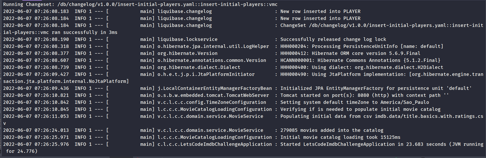
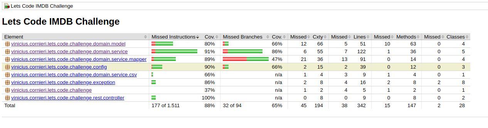

# Let's Code IMDB Challenge

Desafio proposto pela Let's Code para implementar um jogo de cartas 
o qual consiste dado dois filmes do IMDB tentar adivinhar qual possui a maior pontuação,
considerando o numero de votos multiplicado pela nota no site.

## Dados do IMDB
Os dados utilizados foram os disponibilizados pela IMDB no site [IMDB Datasets](https://www.imdb.com/interfaces/). Foram utilizados o dataset de titulos básicos, `title.basics.tsv.gz`, filtrando com grep somente os titulos do tipo filme (movie) resultando no arquivo [title.basics.only.movies.tsv](src/test/resources/imdb.data/title.basics.only.movies.tsv). 
Este arquivo foi feito merge utilizando a classe [FilterTSVRatings](src/test/java/vinicius/cornieri/lets/code/challenge/FilterTSVRatings.java) com o arquivo `title.ratings.tsv.gz` do dataset filtrando todos os filmes que possuiam um rating no IMDB, gerando o arquivo [title.basics.with.ratings.csv](src/main/resources/imdb.data/title.basics.with.ratings.csv) que é utilizado para fazer o carregamento dos dados dos filmes ao iniciar a aplicação.

## Dados Iniciais

Foram criados dois jogadores iniciais com o liquibase, eles podem ser utilizados com as API-KEY:
- **nickname:** *Ready Player One*, **API-KEY:** *player-one-key*
- **nickname:** *Green Mario*, **API-KEY:** *green-mario-key*

Novos jogadores poderão ser criados pela api `POST /player`;

## Apis

A documentação das Apis do projeto se encontram em [src/main/resources/api/swagger-lets-code-challenge.yaml](src/main/resources/api/swagger-lets-code-challenge.yaml).

É importante ressaltar que as Apis `"/game"` necessitam de um HEADER API-KEY com a apiKey do usuário para liberar o acesso ao jogo para o determinado usuário.

### Link de uma Collection do postman de exemplo

https://www.getpostman.com/collections/0a78c0c5407d984c3c04

## Tecnologias utilizadas no projeto
- Java 11
- Spring Boot
- Liquibase
- MapStruct
- Lombok
- OpenApi3
- Jacoco Coverage Report

## Pré-Requisitos para buildar o projeto

- JDK 11
- Maven 3.6.x

ou 

- Docker

## Build do projeto via docker

Para buildar o projeto via docker executar o seguinte comando executado na raiz do projeto:

```bash
docker run -it --rm --name lets-code-challenge-build -v "$(pwd)":/root -w /root adoptopenjdk/maven-openjdk11:latest mvn clean install
```

## Execução do projeto via docker

Após a build para executar o projeto via docker é necessário gerar a imagem pelo comando executado na raiz do projeto:

```bash
docker build -t lets-code-imdb-challenge:latest .
```

Após a criação da imagem o seguinte comando executa a aplicação mapeando para a porta local `8080`

```bash
docker run --rm -p 8080:8080 lets-code-imdb-challenge:latest
```



## Cobertura de código

A cobertura de código foi analisado pelo JaCoCo Reports, que após a build com testes gera o relatório em `target/site/jacoco/index.html`. A cobertura reportada pelo JaCoCo foi de 88%.


